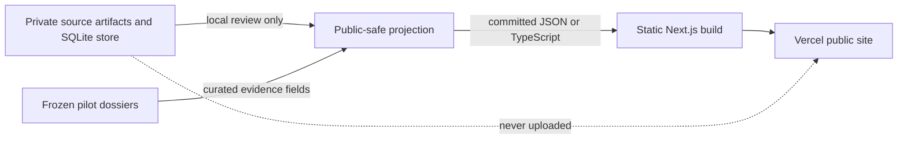

# Portfolio pivot plan — public evidence slice

**Status:** Accepted 19 August 2026 by the project owner after external review  
**Sprint window:** 19–21 August 2026  
**Target:** A credible portfolio release by Friday, 21 August; continued polish
through the existing 1 September public-release date  
**Authority:** This document changes no accepted rule until the project owner
accepts it and the resulting decision is recorded as ADR-021.

## Decision requested

Accept, modify or reject this pivot:

> Ship the smallest honest product that demonstrates the trust platform before
> completing the trust platform.

The project keeps its evidence-first thesis, three researched pilots and tested
pipeline. The sprint changes delivery order. Public proof of user value now
comes before broader schema, extraction and operations work.

Acceptance authorizes only the repository and public-product work specified
below. It does not authorize a provider call, human-language adjudication,
publication of an ineligible claim, deployment of private artifacts or a claim
that Phase 2 or Phase 3 is complete.

## Why this pivot is needed

The repository contains substantial research and engineering, but the public
artifact does not yet demonstrate the product:

- Three source-backed pilot dossiers are frozen.
- The local pipeline has strict retrieval, artifact, milestone-extraction,
  metering, persistence and reconstruction slices.
- The local suite passes 117 tests.
- The private vertical-slice store contains one artifact, one retrieval, one
  completed run and one proposed milestone claim.
- The human-authored golden set remains 30 empty review slots; no extraction
  accuracy result exists.
- The public default branch still presents the project as a concept-stage
  documentation repository.
- The four latest public CI runs fail because one test invokes a repository-local
  `.venv` path that does not exist in CI.
- No `/web` application, map, public dossier page or deployment exists.

The project is therefore stronger as a trust-and-governance prototype than as a
portfolio product. Continuing the current sequence would deepen that imbalance.

## Sprint outcome

By the end of Friday, a reviewer should be able to open one public URL and:

1. Understand the product in 30 seconds.
2. See three Berlin projects on a 2D map.
3. Open C-014 as the flagship dossier.
4. Identify the source-stated expected completion information and how it
   changed over time.
5. Expand the exact German evidence behind a displayed statement and follow the
   original source link.
6. Distinguish a source qualifier, a conflict, a withheld value and an
   unresolved translation without reading the methodology.
7. Understand what the AI pipeline has actually demonstrated, including its one
   completed run and one failed attempt, without being shown an accuracy claim.
8. Reach the repository, see green CI and understand the architecture and
   limitations from a concise README.

The Friday release is a portfolio vertical slice. The 1 September release
remains the date for additional polish, measured extraction breadth and any
public-readiness work that does not fit safely in this sprint.

## Audience tests

The release must pass all three tests.

### Recruiter test

In one minute, a non-specialist can answer:

- What problem does this solve?
- What can I click?
- What did the project owner build?
- Why is AI useful here?
- Is the product live?

**Complete when:** the live URL, screenshot, one-sentence thesis and concise
technology summary appear before roadmap or process detail in the README.

### AI product-engineer test

A technical reviewer can find:

- A shipped user experience.
- Typed Python extraction and validation code.
- Exact evidence-span enforcement.
- Provider, cost and latency metering.
- Human-review and withholding behavior.
- Tests for success and failure paths.
- An honest statement of what has not been evaluated.

**Complete when:** each item is reachable from the README in at most one click
and every claimed behavior points to code, a test, a public page or a measured
run.

### AI-team-lead test

A leadership reviewer can see:

- A clear product decision under schedule pressure.
- Deliberate scope reduction.
- Risk-specific safeguards.
- Separation of human and model authority.
- A documented failed provider attempt and correction.
- A plan for expanding evidence only after the vertical slice ships.

**Complete when:** ADR-021 and the short case-study section explain the pivot,
tradeoff and result without requiring the reader to inspect the full build log.

## Binding constraints

The pivot changes sequence, not trust.

1. **Evidence remains mandatory.** A public factual statement retains a source
   link and exact supporting span. Missing evidence produces an unpublished or
   visibly withheld field, never a guessed value.
2. **German remains canonical.** English is display text only. Contested
   milestone and financial types remain unresolved, and every glossary-derived
   display identifies the glossary version and unverified status.
3. **No accuracy claim.** The empty golden set cannot support precision, recall
   or accuracy language.
4. **Private artifacts remain local.** `data/artifacts/` and its SQLite database
   never enter Git, a Vercel upload or a cloud build context.
5. **Natural persons remain excluded.** Public data names organizations only in
   documented roles.
6. **Project attribution remains careful.** Delay and cost variance attach to a
   project unless a source establishes organizational causation.
7. **The three pilots remain in the release.** C-014 receives the deepest
   treatment; C-010 and C-019 may be thinner but must be honest and
   evidence-linked.
8. **Phase labels remain truthful.** Merging the Phase 2 branch does not mark
   Phase 2 complete. The incomplete data-core and evaluation work stays visible.
9. **No provider call is implied.** Every live model call requires separate,
   explicit owner authorization with a call count and cost ceiling.
10. **Public-release duties remain binding.** Every published project and named
    organization has a correction route. Public deployment uses no analytics or
    cookies during the sprint and proceeds only after the required legal,
    privacy and source-use checks are recorded against authoritative guidance.

If a proposed shortcut conflicts with one of these constraints, reduce the
visible feature rather than weaken the constraint.

## Sprint scope

### Must ship by Friday

- Green public CI on the current data-core work.
- Current work integrated into the public default branch without rewriting
  history.
- A concise portfolio-first README with live-site link, screenshot,
  one-minute product explanation, architecture summary, measured AI behavior
  and limitations.
- The README and landing page state: `Displayed project data is human-curated
  from primary sources. The retained store currently contains one completed
  extraction run over one document; the repository does not establish a total
  historical provider-call count.`
- A statically deployable Next.js application.
- A public-safe, committed data projection for the three pilots.
- A MapLibre 2D Berlin orientation view using a locally bundled,
  license-checked boundary and three local markers, with links to stable dossier
  URLs and no third-party runtime tile request.
- A polished C-014 dossier showing current source-stated completion information,
  change history, qualifiers and expandable German evidence.
- Thin C-010 and C-019 dossier pages with project identity, current evidence
  state, at least one material source-backed item and explicit unresolved areas.
- Visible UI states for source qualification, conflict, withheld content and
  unverified translation.
- A correction route on every project page and wherever a named organization is
  presented.
- A compact AI-method section reporting only measured behavior.
- A production deployment, no analytics or cookies, recorded public-site checks
  and basic mobile/keyboard verification.

### Ship if the must-have path is green

- Social share metadata and a project preview image.
- A lightweight architecture diagram.
- A short recorded walkthrough.
- Additional evidence rows or visual polish on C-010 and C-019.
- A local export command that regenerates the public-safe dataset
  deterministically.

### Deferred beyond Friday

- GitHub Actions Node-runtime deprecation upgrades for `actions/checkout@v4`
  and `actions/setup-python@v5`; both workflows pass today, so revisit after the
  portfolio sprint rather than changing action versions during Gate 2.
- Supabase, Postgres and PostGIS.
- Production API routes or server-side database access.
- Address search.
- Authentication, user accounts or correction workflow implementation.
- Complete project, organization, source, financial, conflict and review-history
  schemas.
- Broad document classification, entity resolution or contradiction detection.
- A 10–20-document extraction batch.
- Human-verified glossary and golden-set evaluation.
- 3D geometry or technical-illustration rendering.
- Ten-project coverage, monitoring, alerts, community submissions or analytics.
- General refactors that do not remove a blocker from the must-have path.

## Public data boundary

The website uses a deliberately small public projection. It does not read the
private SQLite store during a local or cloud build.

The projection may contain only:

- Stable project and source identifiers.
- Public project names, locations and coordinates.
- Organization names in allowed documented roles.
- Dates, amounts and status text approved for the display state used.
- Short exact German evidence spans.
- Original public source URLs and publication dates.
- Qualifiers, conflict state, withholding reason and translation status.
- Display text that does not imply greater verification than the stored state.

It may not contain retained source documents, raw model responses, private
pre-transform hashes, API credentials, personal names or local-only withheld
detail.

Every public projection record must pass a deterministic build-time validator.
At minimum, the validator rejects a displayed factual value without a non-empty
evidence span and HTTPS source URL. A withheld or ineligible projection record
contains only its stable identifier, public state and reason code: the committed
projection has no value, evidence-text or local-detail field for that record.

The build test places a sentinel value in a withheld fixture and proves that the
sentinel is absent from generated HTML, JavaScript and data assets. Before
deployment, a local-only release check also scans the built output for every
current known-withheld value loaded from a gitignored review manifest; neither
the manifest nor its values enter Git or the build context.

## Execution gates

Work proceeds in this order. A later gate does not begin until the preceding
gate is green, except for read-only review or design preparation that cannot
modify overlapping files.

### Gate 0 — Accept the pivot

**Actions**

1. Review this document against `AGENTS.md`, accepted ADRs and the frozen
   dossiers.
2. Resolve only blocking ambiguities listed in the review section below.
3. Record the accepted decision as concise ADR-021.
4. Apply the accepted sprint-process exception to `AGENTS.md`.
5. Point the project checklist at Gate 1.

**Complete when:** the owner has explicitly accepted the plan or an amended
version, ADR-021 records the decision, and the active agent instructions contain
the temporary sprint rule.

### Gate 1 — Repair the public repository

**Actions**

1. Replace the test's repository-local `.venv/bin/python` assumption with the
   running interpreter.
2. Run the complete local suite and build-log checker.
3. Push the repair to `phase-2-data-core` and wait for a green GitHub workflow.
4. Review the full Phase 2 diff for secrets, private artifacts, false completion
   claims and release-blocking defects.
5. Merge the branch into `main` without claiming Phase 2 completion.
6. Confirm GitHub's default branch shows the pipeline, tests and truthful
   current status.
7. Create or switch to the Phase 4 public-slice branch for website work.

**Complete when:** local checks pass, the public workflow is green, `main`
contains the current work, no private artifact is tracked, and the README no
longer describes the repository as an abandoned concept.

### Gate 2 — Freeze the public-safe dataset

**Actions**

1. Define the smallest display schema required by the three dossier pages.
2. Curate C-014 fields first from the frozen dossier and approved source states.
3. Add the minimum honest C-010 and C-019 records.
4. Encode unresolved and withheld values structurally rather than as prose-only
   caveats.
5. Select the map asset: a locally bundled Berlin boundary with recorded source,
   license, retrieval date and coordinate system. The default view makes no
   third-party runtime request; hosted basemap tiles remain optional until their
   credentials, cookies, terms and attribution have been approved.
6. Add build-time tests for evidence, source URL, naming, private-field
   exclusion and withheld-value absence from generated output.
7. Obtain the required review decision for every value intended to render.

**Complete when:** all three records pass the validator, every rendered factual
value has evidence, the committed projection gives withheld records reason
codes but no value fields, the map asset has recorded source and license, and
both the sentinel and local known-withheld scans find no withheld detail in the
built output.

### Gate 3 — Ship the flagship dossier

**Actions**

1. Build the shared page shell and stable project route.
2. Make the expected-completion story the visual lead.
3. Render the C-014 change timeline.
4. Render qualifiers as part of the value, not decoration alone.
5. Add evidence expansion with exact German span, date and source link.
6. Render conflict, withheld and translation-unverified states.
7. Add the shared correction route for the project and named organizations.
8. Verify narrow mobile width and keyboard access.

**Complete when:** a first-time reader can explain what changed on C-014 and
open the supporting evidence in under one minute on desktop and mobile.

### Gate 4 — Add orientation and breadth

**Actions**

1. Add a MapLibre view using the approved local Berlin boundary and one local
   marker per pilot, without a third-party runtime tile request.
2. Link every marker to its dossier route.
3. Add thin C-010 and C-019 pages through the shared dossier interface.
4. Keep unresolved states visible rather than filling empty sections.
5. Verify map fallback content remains usable by keyboard and without the map.

**Complete when:** all three projects are reachable from the landing page and
map, and a non-map list provides the same navigation.

### Gate 5 — Expose the real AI story

The method section reports the existing evidence:

- The retained store contains one completed `gpt-5.6-luna` extraction run over
  one C-014 document; it does not establish the total historical provider-call
  count.
- Stored usage for that run is 17,685 total input tokens: 3 uncached and 17,682
  cached, plus 1,053 output tokens and zero cache-write tokens.
- The cache read establishes prefix reuse but the stored repository evidence
  does not establish which earlier request primed it. The public explanation
  leaves that origin unresolved.
- USD 0.00161784 recorded cost and 10,017 ms latency.
- One proposed milestone claim routed to review, not publication.
- One later incomplete provider response that produced no stored run or claim.
- The adapter correction that now preserves safe failed-attempt accounting for
  future authorized calls.
- Existing `first live call` wording in the build record is not used as an
  absolute historical request count. Gate 5 adds an explicit clarification:
  stored evidence supports one recorded completed extraction run, while the
  request that primed the cache is unestablished. The historical entry is not
  silently rewritten.
- 117 passing local tests at pivot time.
- No verified accuracy, precision or recall result.

**Complete when:** every number is reproduced from stored metadata or test
output, the cached/uncached split is visible, no total provider-call count or
cache origin is asserted, the failed call is not described as a successful run,
the build record carries the explicit cache-history clarification, and the page
makes no quality claim the empty golden set cannot support.

### Gate 6 — Deploy and package the portfolio

**Actions**

1. Deploy the static application.
2. Before making it public, verify the applicable legal, privacy and source-use
   requirements against authoritative guidance and record the evidence. Keep
   the deployment as a restricted preview if this check is incomplete.
3. Verify every route, correction route and source link in production.
4. Check mobile layout, keyboard navigation, missing-data states and a failed
   map-load fallback.
5. Rewrite the README opening around the live product and measured behavior.
6. Add the production URL and representative screenshot.
7. Run final local and public checks.
8. Record known limitations and the next action for the 1 September release.

**Complete when:** the public URL works from a fresh browser, CI is green, the
README leads with the product, the required public-site checks and correction
routes have evidence, and the repository contains no claim that the deferred
systems are complete. A restricted preview is useful sprint evidence but does
not satisfy the public-deployment criterion.

## Timebox and cut order

### Wednesday — integrity first

- Review and accept the pivot.
- Apply the sprint-process exception.
- Fix CI and obtain a green public run.
- Integrate current work into `main`.
- Start the public projection and application shell only after Gate 1 is green.

### Thursday — complete the vertical path

- Freeze the C-014 projection.
- Complete the flagship dossier and evidence interaction.
- Deploy an unpolished but functional production skeleton.
- Add the map and thin project pages after the flagship path works.

### Friday — package and verify

- Complete all three project routes.
- Add the measured AI-method section.
- Polish the landing page and README.
- Verify production, mobile, keyboard and fallback behavior.
- Record a walkthrough only if the live product and public repository are green.

If time expires, cut in this order:

1. Walkthrough video.
2. Social image and share previews.
3. Additional C-010/C-019 detail.
4. Map visual refinement.
5. Architecture illustration.

Do not cut C-014 evidence interaction, visible uncertainty states, green CI,
the public-safe data boundary or truthful limitations.

## Focus rules

These rules prevent the pivot from becoming another expansion phase.

- Work on one active gate at a time.
- Treat a new idea as deferred unless it removes a blocker from the active
  gate's completion criterion.
- Timebox a blocker to 30 minutes of diagnosis before choosing the documented
  fallback or escalating a concrete decision.
- Prefer a static implementation over a new runtime dependency during the
  sprint.
- Prefer one reusable dossier interface over project-specific page structures.
- Preserve unresolved data states instead of expanding the schema to eliminate
  them.
- Stop documentation after ADR-021, the README rewrite, required short build-log
  records and the final limitations update.
- Make no provider call during the sprint unless the owner separately approves
  the exact count, documents, purpose and maximum cost.
- In the build log, reserve bare backtick-wrapped hexadecimal strings for Git
  commits. Content and artifact hashes include `sha256:` inside the backticks;
  run identifiers retain their `run-` prefix.
- Keep reviewers read-only; the main agent remains the single repository writer.

## Proposed sprint-process exception

If the pivot is accepted, copy an exact, owner-approved version of this rule
into `AGENTS.md` with an expiry:

> **Portfolio sprint, through 21 August 2026:** Use one short build-log entry per
> shipped gate or material failure. Code, tests, styling and routine fixes do not
> receive full entries during this sprint unless a real failure, measurement or
> course correction needs explanation. Record the day's work hashes in one
> end-of-day `docs(build-log):` commit and make that closing commit the final
> planned sprint-work push of the day. Any later emergency fix opens a new
> logged session and receives a new closing hash commit. Bare hexadecimal
> strings in backticks are Git commits only; content and artifact hashes carry
> `sha256:`, and run identifiers retain `run-`. Create no ADR after ADR-021
> unless a new owner decision changes safety, legal, privacy or publication
> behavior. The evidence, privacy, naming, single-writer and human-authority
> rules remain fully binding. This exception expires after the Friday handoff.

This exception reduces ceremony without hiding model use, failures or material
decisions. The post-Friday handoff either removes it or replaces it with a new
owner-approved rule.

## Post-Friday AI evidence plan

Broader model evidence begins after the public vertical slice is stable. This
section is planning only and authorizes no calls.

### Stage A — calibration batch

- Select 3–5 already authorized, retained documents that exercise milestone
  extraction supported by the current schema.
- Freeze document IDs, prompt, model, schema, threshold and pricing versions.
- Set an explicit call count and hard cost ceiling.
- Run once per document; do not retry silently.
- Report completed, rejected, withheld and failed attempts separately.
- Inspect every proposed claim locally and keep it non-public until review.

**Complete when:** every authorized attempt has content-free accounting, a
stable disposition and no unreviewed public output.

### Stage B — portfolio measurement batch

Expand toward 10–20 documents only after Stage A exposes no blocking storage,
privacy or review defect. Publish counts, cost, latency, review rate and failure
classes. Continue to withhold accuracy language until the human-authored golden
set exists.

## Risks and fallbacks

A fallback protects the remaining work; it does not retroactively satisfy the
original gate. The Friday handoff records every invoked fallback and the reduced
result plainly.

| Risk | Trigger | Fallback |
| --- | --- | --- |
| CI remains red | The interpreter fix does not produce a green public run | Stop frontend work, reproduce the CI environment and repair the actual failure first. |
| Phase 2 merge exposes a serious defect | Integration review finds privacy, secret or false-completion risk | Keep the branch unmerged, fix the defect there and preserve `main`; do not hide it with a README change. |
| Public data cannot be approved in time | A value lacks an eligible evidence/review state | Render an explicit withheld or unresolved state; never substitute model output. |
| Map integration consumes the timebox | No functional map after the allotted implementation block | Ship an accessible project list and simple Berlin orientation panel; add the interactive map next. |
| C-010 terminology blocks English display | The German milestone type remains contested | Show the German term, source span and `Milestone type unresolved`; omit the asserted English type. |
| A source becomes unavailable | Production link check fails | Keep the dated short evidence span and mark the original link unavailable; do not rehost the artifact. |
| Website polish threatens deployment | Core pages work but visual refinements remain | Deploy the functional version and defer refinement. |
| New backend work appears necessary | A UI field has no current schema | Reduce or withhold the field unless the missing work blocks the flagship evidence path. |
| Public-site review is incomplete | Legal, privacy or source-use evidence is missing | Keep an access-restricted preview, record the blocker and do not call it the public release. |

## Review instructions

The reviewer returns one of:

- **Approve** — no blocking change.
- **Approve with changes** — list the exact edits required before acceptance.
- **Reject** — identify the violated rule or infeasible dependency and propose
  the smallest viable replacement.

Review only these questions:

1. Does the pivot preserve every evidence, privacy, source-use, naming,
   correction and human-authority rule?
2. Is any must-have deliverable dependent on deferred infrastructure?
3. Can the public projection prevent private or withheld content from entering
   the client bundle?
4. Does merging incomplete Phase 2 work remain truthfully represented?
5. Are the Friday gates objectively verifiable?
6. Does the process exception preserve material accountability while removing
   sprint ceremony?
7. Does the AI-method section distinguish measured behavior from evaluation?
8. Is any phrase likely to mislead a recruiter or technical reviewer about what
   is live, automated or verified?

The reviewer should not reopen the product thesis, three-pilot decision, chosen
stack, 2D-before-3D decision or post-v0 golden-set sequencing without new
blocking evidence.

## Acceptance record

- **Project-owner decision:** Accepted.
- **Decision date:** 19 August 2026.
- **Accepted reviewer changes:** publish cached and uncached token accounting;
  harden build-log identifier and closing-push rules; structurally exclude
  withheld values from the projection and build; remove the map's unvetted
  runtime tile dependency.
- **Modified or rejected reviewer changes:** preserved MapLibre with a local,
  license-checked boundary instead of replacing the selected map stack; retained
  the `run-` prefix for run identifiers instead of labelling them as SHA-256.
  No reviewer finding was rejected.
- **ADR-021 commit:** `3e96766` — `docs(process): accept portfolio pivot`.
- **Gate 1 owner:** Main agent (Codex).
