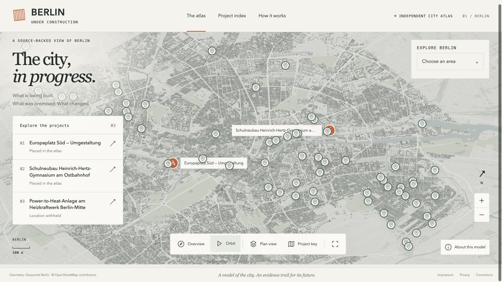

# Berlin, Under Construction

## Making Berlin’s construction projects easier to understand

An interactive city atlas that connects construction projects to the original
sources behind their dates and status. Built as an AI-assisted civic information
prototype, it makes uncertainty visible and keeps evidence close to every claim.

[Explore the atlas](https://berlin-under-construction.vercel.app/) ·
[View the code](https://github.com/Gregjones1997/Berlin-Under-Construction/tree/phase-4-public-slice) ·
[Explore the method](https://berlin-under-construction.vercel.app/method/)

### My role

I led product direction, visual design, information hierarchy and publication
scope. I reviewed source passages for the three original dossiers and worked
with AI agents on research, implementation and testing. The repository records
those contributions; I do not present the implementation as code I wrote alone.

### The challenge

Construction information is scattered across official project pages, budgets and
announcements. A completion forecast is different from a handover date. An older
promise and a newer update may disagree. Combining them into one confident status
can make a polished interface misleading.

As a non-native German speaker, I made that language barrier part of the design
problem. The system preserves original German evidence and separates literal
source matching from interpretation that needs human language judgment.

### What I built with AI

The prototype combines an architectural 3D map with concise project cards and
expandable evidence. Its 150 basic listings use official register titles and
reference points. They remain visually distinct from three reviewed dossiers,
two of which have published map positions. Five basic listings also carry six
source-stated date fields.

AI agents helped locate sources, prepare extraction proposals, implement the
interface and develop validation checks. Source collection and span matching are
not presented as an independent AI accuracy evaluation. The system rejects
unsupported publication data rather than silently supplying a plausible value.

### Decisions that shaped the product

**Keep the first view useful.** Cards lead with the project and supported dates.
An arrow leads to the original source; detailed evidence stays one step away.

**Preserve disagreements.** The Europaplatz dossier retains competing financing
statements in a dedicated conflict presentation. An unresolved number does not
become a single apparently settled total.

**Publish only the scope the evidence supports.** The energy dossier has no map
pin because its location is withheld. The broader register listings show reference
points, not surveyed site boundaries. A planned finish is never labeled “on time”
without the necessary baseline and progress evidence.

**Make the work inspectable.** The Astro/TypeScript interface and Python evidence
pipeline are documented in the repository. The Three.js city model is self-hosted;
source documents remain private, with short evidence spans and original links
exposed to readers.

### What the prototype demonstrates

The project demonstrates a working source-to-interface workflow, a public map,
traceable date fields and explicit handling of missing or conflicting evidence.
The September 21 engineering check passed **207 tests** and TypeScript checking.
That is evidence of tested software behavior, not an extraction-accuracy score.

One recorded extraction ran in 10,017 ms with USD 0.00161784 in recorded provider
cost. It is a single stored run, not a benchmark, total project cost or proof of
production-scale economics. The method record also discloses a rejected incomplete
response and missing accounting for that failed attempt.

### What comes next

Independent German glossary verification and scored extraction evaluation remain
unfinished. More milestone research, a German/English interface and physical-phone
performance checks are next steps. There are no claimed adoption or impact metrics.

A business adaptation could fit translation and terminology checks into an
existing internal review process. That is a proposed application, not an
integration this prototype already delivers.

### Try it in two minutes

1. Open [Europaplatz Süd](https://berlin-under-construction.vercel.app/#C-014), inspect its dates, then expand the project overview to see evidence and history.
2. Open [Dorfteich Lichtenrade](https://berlin-under-construction.vercel.app/#MB-2023-00823) to compare a basic listing with sourced dates against a full dossier.
3. Visit [How it works](https://berlin-under-construction.vercel.app/method/) for the AI contribution, recorded run and limitations.
